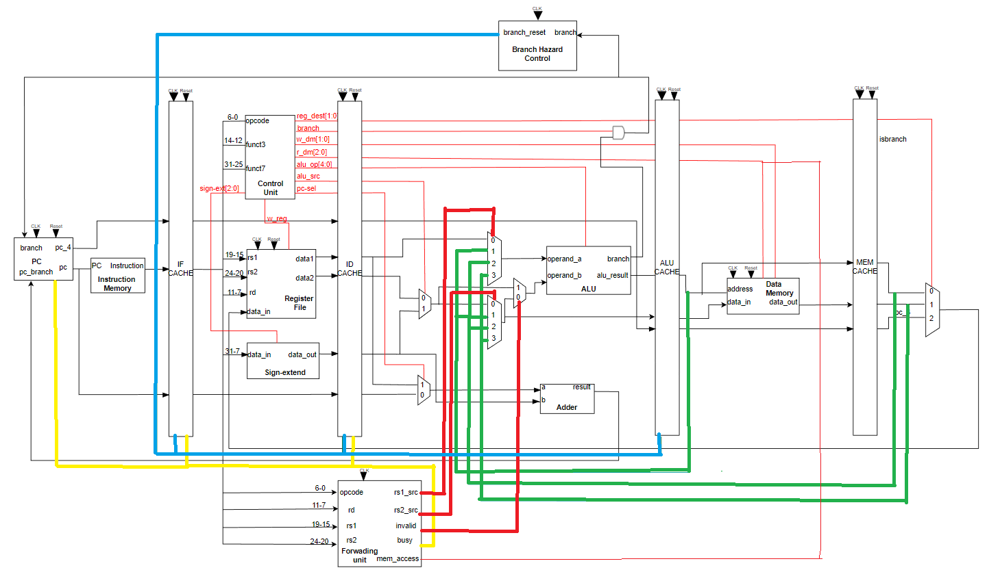
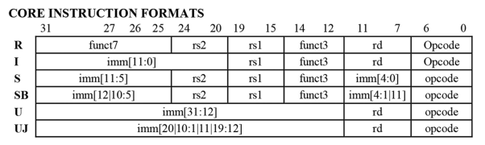
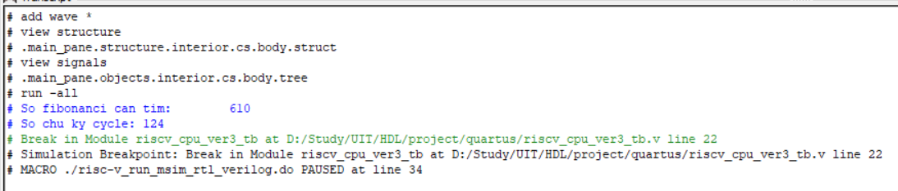
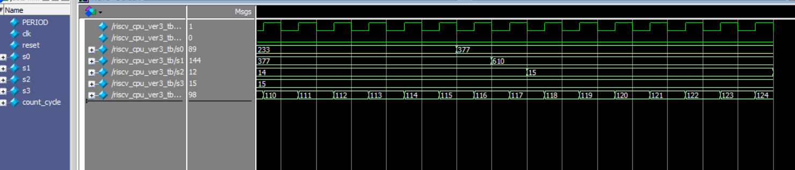

# Pipelined Processor RISC-V Instructions

## Project Overview

This project aims to design and implement a pipelined processor that executes RISC-V instructions. The primary objectives are to achieve high performance through pipeline stages, ensure proper instruction handling, and manage hazards efficiently. This README provides an overview of the project structure, setup instructions, and a brief explanation of the key components involved in the design.

## Table of Contents
- [Project Overview](#project-overview)
- [Features](#features)
- [Usage](#usage)
- [Block Diagram](#block-diagram)
- [Supported Instructions](#supported-instructions)
- [Hazard Management](#hazard-management)
- [Testing](#testing)
- [Background](#background)


## Features

- **Five-stage pipeline**: Instruction Fetch (IF), Instruction Decode (ID), Execute (EX), Memory Access (MEM), and Write Back (WB).
- **Hazard detection and forwarding**: Efficient management of data and control hazards.
- **Support for RISC-V base integer instruction set (RV32I)**.
- **Simulation and testing environment**: Scripts and tools to test the processor with various instruction sets.

## Usage

To run this work, you will need a verilog compiler such as ncverilog, Vivado, Quartus.
As a university Project, I used Quartus and implemented it on DE2-board for verification.

## Block Diagram



## Suported Instructions



Overall, the design support almost basic instructions.

For more detail, click the [link](https://docs.google.com/spreadsheets/d/1AXK-irwirG9tSc05poDliCQUe7ENwq49/edit?usp=sharing&ouid=118179136445249862692&rtpof=true&sd=true) to know more supported instructions

## Hazard Management

Our work supports data forwarding to prevent data hazard. Forwarding works in most case but branch jump, to deal with it our design supportd hazard detection as well.

## Testing

It will caculate and store numbers in the Fibonacci number array to register x0 with the figure of elements in the array as input N.

```c
        addi x0, x5, 0 
        addi x1, x5, 1 
        addi x2, x5, 1 
        addi x3, x5, 15   //The final value stored in x0 is the 15th fibonacci number
        loop:
        beq x2, x3, end 
        add x4, x0, x1
        add x0, x5, x1
        add x1, x5, x4
        addi x2, x2, 1
        jal x6, loop 
        end:
        addi x2, x5, 0    //The final value stored in x2 is 0 which is the signal for the end
```

### Result on model-Sim

Result on monitor:


Result as Waveform:


## Background

This is originally a course project of Digital system design with HDL at University of Information and Technology.

Although the design can handle numerous testcases, the Control Hazard had to take two cycles for solving. 

This design can still be improved by upgrading method to handle Control Hazard in only one cycle. And I may update it in future.


